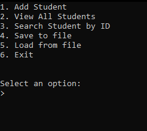

# Student Gradebook C++

## A command line application for managing a student gradebook built using C++.

This project was developed as a personal project to further develop my skills as a developer.

## Features:

1. ✅ Add Student to Gradebook
2. ✅ View All Students in Gradebook
3. ✅ Search Students in Gradebook by ID
4. 📃 Save Gradebook data to file
5. 📃 Load Gradebook data in to the program

> ✅ = Complete  
> 📃 = In progress

You can view progress for the project here:
[Student Gradebook - Trello Board](https://trello.com/b/YATQDZ2Y/student-gradebook)

## Getting Started

Requirements:
* C++ Compiler (g++)
* Make (recommended but optional for Makefile)
* Windows (Operarting System)

### How to build

Here are the step by step instructions to install the project currently:


### Manual
1. Clone the project
2. Change directory to project
3. Create a bin directory
4. Run 'make'
5. Run the bin executable by typing .\bin\gradebook.exe


### Command Line Form
```
git clone https://github.com/Robert-Walker0/Student-Gradebook
cd student-gradebook
mkdir bin
make
.\bin\gradebook.exe
```

## Usage

Once you run the program, this menu popup:



Just type the number of your choice and follow the instructions in the prompts.

## License
This project is licensed under the MIT License. See the LICENSE file for more details.
